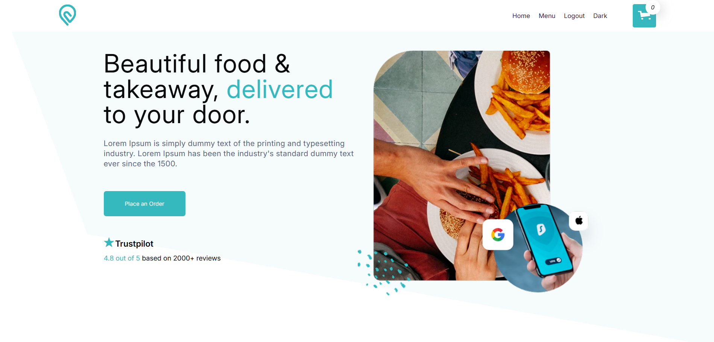

# 🍔  The Best Food Ordering App

Welcome to **Food Order** – a modern and stylish web application for online food ordering. Built with **React**, using **Redux Toolkit**, **TypeScript**, and custom dark/light theme support.



---

## 🚀 Features

- ⚛️ Modern stack: React + Redux Toolkit + TypeScript
- 🎨 Light/Dark theme support via ThemeContext
- 🛒 Smart cart with item quantity, pricing, and total summary
- 💾 Data persistence using `localStorage`
- 📦 Clean and scalable architecture
- ✅ Responsive and user-friendly UI
- 🧪 Unit test support with Jest

---

## 📂 Project Structure

```
src/
├── Components/
│   ├── Layout/          # Header, Footer
│   ├── ThemeContext/    # Theme provider
│   ├── redux/           # Redux slices (usersSlice)
│   └── ...              # Reusable components
├── Pages/
│   ├── Order.tsx        # Order confirmation page
│   └── ...
├── App.tsx
└── main.tsx
```

---

## ⚙️ Getting Started

### 1. Clone the repository:

```
git clone git@github.com:oCMEXo/SDC_React_TheBest.git
```

### 2. Install dependencies:

```
npm install
```

### 3. Start the development server:

```
npm run dev
```
> Powered by **Vite** for lightning-fast development.

### 4. Open a new terminal, run the command to start the Backend server.

```
cd .\Api

node Api.js
```

---

## 🧪 Running Tests

```
npm run test
```

Jest is configured with `ts-jest` for testing TypeScript components.

---

## 🛠 Tech Stack

- React
- TypeScript
- Redux Toolkit
- Vite
- Jest
- CSS Modules
- ThemeContext API
- PostgreSQL
- REST
- Node.js

---

## 📦 Key Functionality

- Add items to the cart
- Adjust item quantity (+/-)
- Display total price
- Confirm and submit orders
- Input validation (Street, House)
- Clear cart after submission
- Auto scroll to top on page change

---

## 🌓 Theme Toggle

Supports light/dark mode switching using context:

```tsx
const { theme, toggleTheme } = useContext(ThemeContext);
```

---

## 🤝 Contact

Author: **Artsiom Harminovich**   
GitHub: [@oCMEXo](https://github.com/oCMEXo)   
Linkedin: [@Artsiom Harminovich](https://www.linkedin.com/in/artsiom-harminovich-6a4869328/) 
